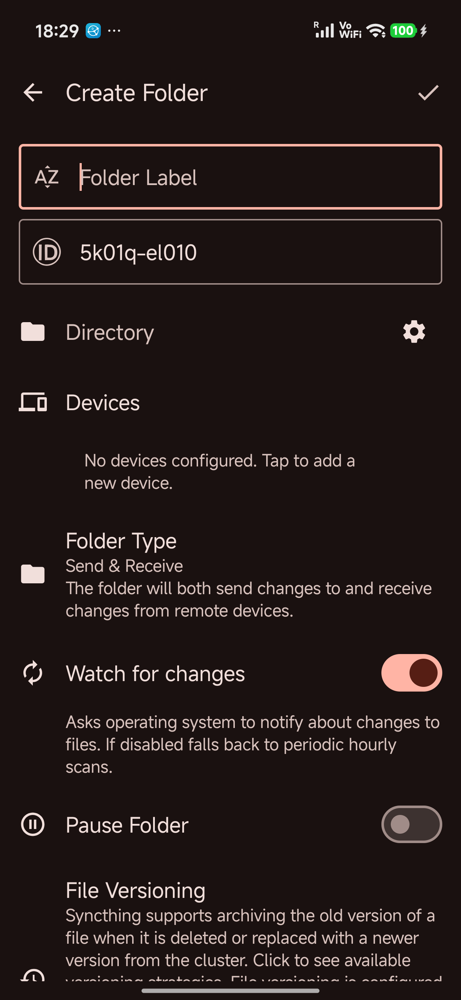
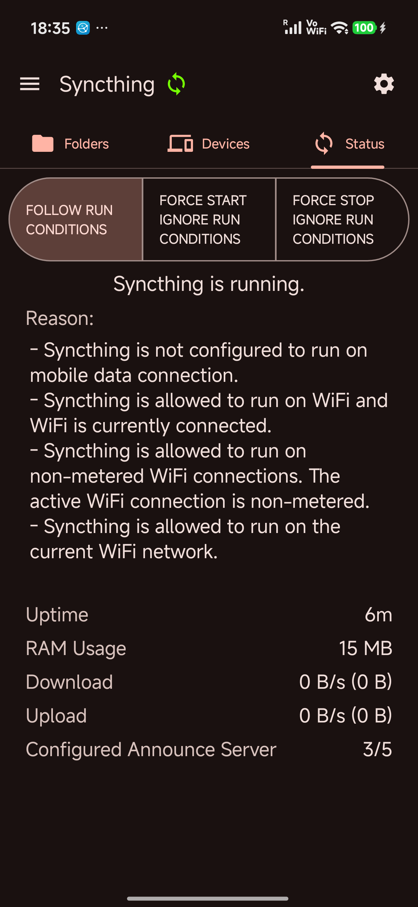
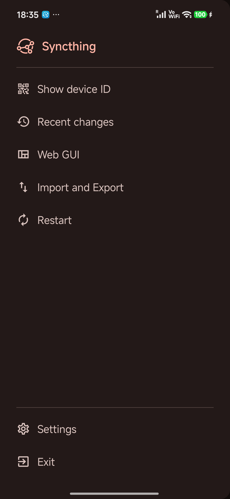
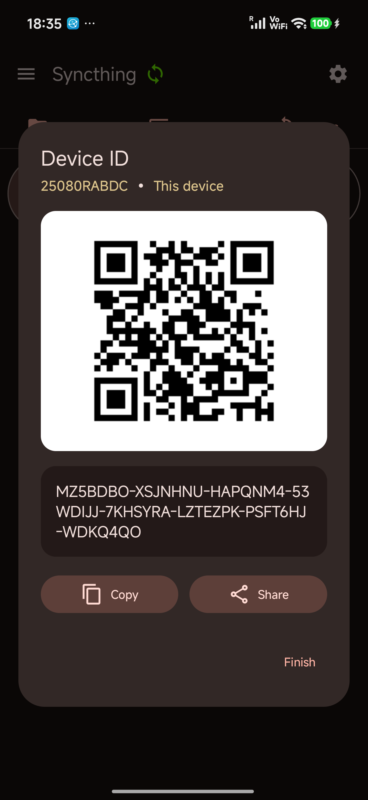
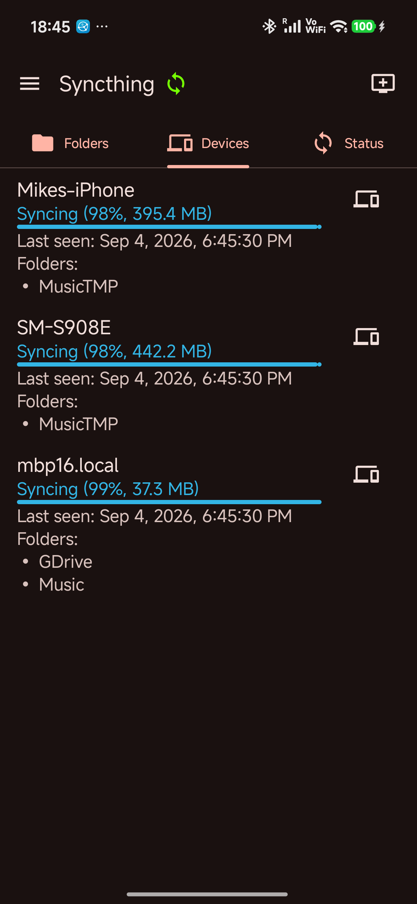
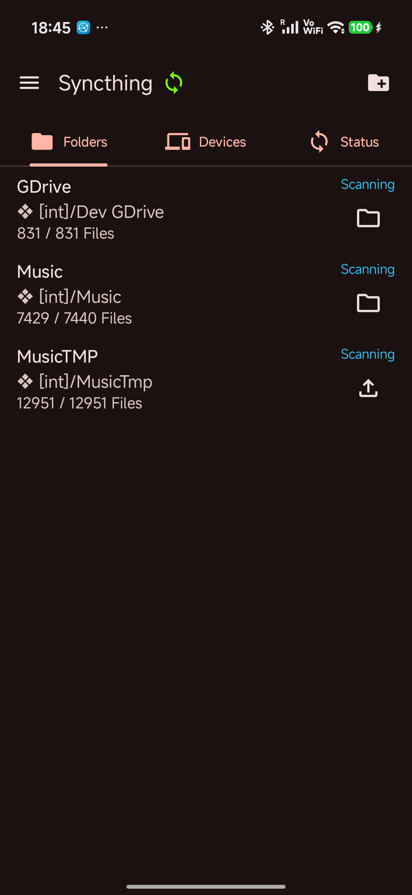

# Syncthing for Android

A native Android wrapper for [Syncthing](https://github.com/syncthing/syncthing), forked
from [researchxxl/syncthing-android](https://github.com/researchxxl/syncthing-android).

This fork exists because Syncthing-Fork stopped publishing updates to the Play Store. The goals
are to modernize the codebase, slim it down and keep it maintainable going forward. A lot has
changed, so you may run into issues. Reported bugs will be fixed as quickly as possible.

Grab builds from the [Releases](../../releases) section. Please ask for help on the forum or
social media before opening an issue on the tracker.

## Distribution

The goal is to make this app available on as many app stores as possible. Planned rollout, in
order:

1. Google Play Store
2. Samsung Galaxy Store
3. Xiaomi GetApps
4. OPPO App Market
5. Other smaller app stores as time permits

APKs are always available from the [Releases](../../releases) section regardless of store
availability.

 ·  ·  ·  ·  · 

## What's Different in This Fork

### Modernization

- Entire codebase converted from Java to Kotlin
- Threads and Runnables replaced with coroutines and Jobs
- LocalBroadcastManager replaced with SharedFlow
- CONNECTIVITY_ACTION broadcasts and NetworkReceiver replaced with
  `ConnectivityManager.NetworkCallback`
- Deprecated APIs removed (`getParcelableExtra`, `getParcelableArrayListExtra`, `JSON.parse`,
  `setBackgroundDrawable`, `setTextAppearance`, etc.)
- Drawables cleaned up and migrated to Material 3 icons

### Dependencies

- Networking: Volley replaced with OkHttp
- Crypto: jBCrypt replaced with `at.favre.lib:bcrypt`
- Added: Coroutines, Lifecycle (4 modules), CameraX, ViewPager2, WorkManager, Navigation Compose,
  Compose Adaptive
- Removed: Volley, jBCrypt, LocalBroadcastManager, fragment-ktx, RecyclerView, Annimon Stream,
  zxing-android-embedded

### Build and Tooling

- Python build scripts replaced with Go scripts in `scripts/`:
  - `buildSyncthing.go`: cross-compiles the Syncthing native library for all Android ABIs,
    bootstrapping the required Go toolchain and configuring the NDK
  - `initDevEnv.go`: verifies and installs Android cmdline-tools, platform-tools, build-tools and
    NDK into the SDK
  - `installSyncthing.go`: clones the Syncthing source at the pinned release and vendors it into
    the submodule directory
  - `updateSyncthing.go`: checks for new Syncthing releases, bumps `version-name` and
    `version-code` in `libs.versions.toml`, and re-vendors the sources
  - `release.go`: creates an annotated git tag and pushes it to origin
- ProGuard/R8 enabled with minification, resource shrinking and log stripping (roughly 50%
  smaller app)
- minSdk raised from 23 to 24, targetSdk raised from 36 to 37
- ABI splits enabled for APK builds, automatically disabled for AppBundle builds
- CI: reusable workflows and automated run cleanup

## Building

Ensure the Android SDK and NDK are in your `$PATH`. If they are not, the init script will download
and install fresh copies. Required versions are listed in `gradle/libs.versions.toml`.

Add both paths to a `local.properties` file in the project root:

```properties
sdk.dir=/Path/to/sdk
ndk.dir=/Path/to/sdk/ndk/version/
```

For more details, see [the wiki](wiki/README.md).

## Switching from the Deprecated Official Version

Switching is easier than you might think. See
the [migration guide](wiki/migration/Switching-from-the-deprecated-official-version.md) for
step-by-step instructions.

### Regressions

- Not yet available on F-Droid. See [Distribution](#distribution) for the store rollout plan
- Not yet on Weblate for string translations

## Wiki

Our knowledge base is published [here](wiki/README.md).

## Acknowledgments

This project was forked
from [researchxxl/syncthing-android](https://github.com/researchxxl/syncthing-android), which was
originally forked from
[syncthing/syncthing-android](https://github.com/syncthing/syncthing-android).

Special thanks to the former maintainers:

- [researchxxl](https://github.com/researchxxl)
- [Dhruv Bhavsar](https://github.com/dbhavsar76)
- [Catfriend1](https://github.com/Catfriend1)
- [imsodin](https://github.com/imsodin)
- [nutomic](https://github.com/nutomic)

See [CONTRIBUTORS.md](CONTRIBUTORS.md) for a full list.

## Privacy Policy

See [privacy-policy.md](privacy-policy.md).

## License

Licensed under the [MPLv2](LICENSE).